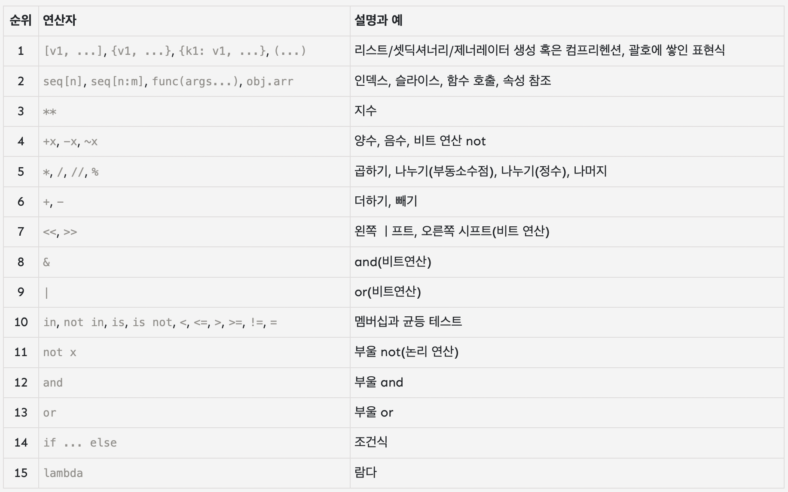
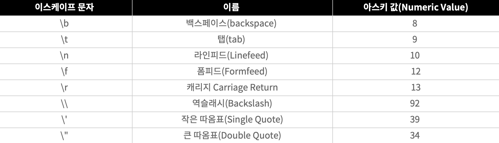

# python 문법

문자열은 ' " '''로 감싸서 사용

''' or """은 여러줄에 걸쳐서 담을 수 있다

### 입력

- 사용자의 입력을 받음
- string으로 입력을 받는다

```python
  input()
```

- input함수에 문자열을 매개변수로 넘겨주면 입력을 받을 때 가이드로 출력된다

### 변수

- 값을 저장하는 메모리 공간
- 값을 저장하기 위해 사용
- 변수명은 숫자, 영문으로 작성한다

  - 숫자로 시작하거나 숫자로만 이루어진 변수명은 오류를 발생 시킨다
  - 띄어쓰기는 언더바(\_)를 사용하여 구분
  - 대소문자를 구분한다
  - 예약어는 변수명으로 사용할 수 없다

- c와 달리 변수 선언시 자료형을 명시하지 않는다

  ```python
  a = 100
  b = 'python'
  ```

### / 연산자

- / 연산을 진행한 값을 애 float이다

### print

- "+", "," 를 이용하여 자료형이 다른 값을 연결해 출력할 수 있다
  - +는 문자열을 띄어쓰기 없이 연결
  - ,는 문자열을 띄어쓰기를 추가하여 연결

### int함수

- 입력 받은 값을 정수로 타입 변경을 한다
  ```python
  int('123') --> 123
  int('12.3') --> 12
  ```

### 연산자

| 연산자 |      의미      |
| :----: | :------------: |
|   /    | 나눈 값(float) |
|   //   | 나눈 몫(정수)  |
|   %    |     나머지     |
|  \*\*  |      제곱      |

### 대입연산자

- 대입연산자의 우측 연산이 끝난 후 좌측에 대입된다

  - 변수와 변수의 연산, 변수와 값에 연산, 값과 값이 모두 연산 가능하다
  - 대입된 변수는 새로운 값으로 덮어 씌어진다
  - 대입연산자에 왼쪽이 변수가 아니라면 오류 발생
  - 대입연산자의 왼쪽애는 한개의 변수가 존재해야 한다
  - 여러개의 값을 한번에 대입 가능하다

    - 좌우 값의 갯수가 같아야 한다

      ```python
      a, b = 100, 200
      # a = 100
      # b = 200
      ```

      에러 코드

      ```python
      num1, num2 = 100, 200
      num1, num2 = 100
      num = 100, 200 # 에러는 발생 X
      ```

### 비교 연산자

- 값을 비교
- 단독으로는 잘 사용하지 않음
- 주로 조건문이나 반복문과 함께 사용
- 변수에 들어 있는 값을 주로 사용

### 논리 연산자

- 비교 연산자가 여러번 필요할 때 사용
- 만약 num 변수의 값이 10과 20 사이에 있어야 한다면

  - 조건 1) num은 10보다 커야 함
  - 조건 2) num은 20보다 작아야 함

  | 종류 |
  | :--: |
  | and  |
  |  or  |
  | not  |

### 연산자 우선 순위

근데 솔직히 이거 외워서 코드에다 써먹는 것보다 걍 괄호로 우선순위 명시하는게 더 가독성 좋아 보이는데 음...



### 데이터형

- 변수나 상수의 종류를 의미

- 다양한 종류의 변수가 존재

- 4가지 기본 데이터형

  - int
  - float, double
  - string
  - boolen

- type() 함수를 통해 변수의 데이터형을 확인할 수 있다

  

#### 정수형

- 소수점이 없는 수
- 값의 크기에 제한이 없다


#### 실수형

- 소수점이 있는 수

#### 

```
정수 O 정수 = 정수
실수 O 실수 = 실수
정수 O 실수 = 실수

정수 / 정수 = 실수
```


#### 문자열(String)

- string에 약자인 str로 표현
- 글자들의 집합
- 중간에 띄어쓰기도 문자열에 포함
- 0개의 문자도 문자열로 취급
- escape문자 사용 가능
  
  - \ 하나만 사용하여 출력할 수 있으나 \뒤에 이스케이프 문자로 취급될 수 있는 문자는 와서는 안됨


- 더하기 연산자로 문자열을 연결할 수 있다
- 문자열에 곱하기 연산자를 사용하면 문자열이 곱한 값 만큼 반복된다
- strV[number] 형태로 문자열에 특정 위치에 있는 문자에 접근 가능하다
- number가 음수일 시 뒤에서 부터 센다
- 문자열 슬라이딩 가능


- 문자열 관련 함수

  - len()
    - 문자열의 길이를 파악
    - 공백 포함

  - upper(), lower()

    - upper() : 영문 소문자를 영문 대문자로 변환
    - lower() : 영문 대문자를 영문 소문자로 변환
    - 영문에만 영향

  - isupper(), islower()

    - isupper() : 문자열이 모두 대문자면 true를 반환
    - islower() : 문자열이 모두 소문자면 true를 반환

  - count()

    - 문자열에서 특정 문자가 몇번 등장하는지 확인함

  - find()
    - 어떤 글자가 문자열의 몇 번째에 위치하는지 찾음
    - 문자열의 위치는 0번째부터 시작함
    - 두번째 매개변수로 시작 위치를 지정할 수 있음


#### 논리형(bool)

- 참과 거짓을 표현


### 제어문

- 순차 구조

  - 순차적으로 코드가 실행됨
  - 물이 위에서 아래로 흐르듯이 차례대로 흘러가는 것과 같음
  - [시작]에서부터 [종료]까지 각 단계가 순서 그대로 실행되는 구조
  - 가장 단순한 구조이기도 하지만, 실제로 많이 사용되는 구조이기도 함

- 선택 구조

  - 두 가지의 경우 중에서 어느 하나를 선택한 영향으로 코드가 실행됨
  - 길에서 갈림길을 만나면 어느 한쪽으로만 가야 하는 것과 같음

- 반복 구조

  - 동일한 코드, 특정한 단계가 여러 번 반복해서 실행됨
  
- if문

  - 만약에 ~라면으로 해석
  - 참일 때는 무엇을 실행하고 거짓일 때는 아무것도 하지 않는 가장 단순한 형태의 조건문
  - 들여쓰기로 블럭 구분

- if else문

  - 거짓일 때 실행해야 할 문장이 따로 있을 때 사용함
  - 조건식이 참이라면 문장1을 실행하고 그렇지 않으면 문장2를 실행함

- 중첩 if문

  - 조건을 검사하는 과정이 2번인 경우
  - 서울에 사는 학생 중에서 25세 이상인 학생이 몇명인지 구하는 경우
    - 우선 학생의 주소가 서울인지 아닌지 확인
    - 주소가 서울인 학생 중에 25세 이상인 사람의 수를 구함

- elif문
  - if else문을 줄여서 elif문으로 사용
  - if else문 안에 if else문을 사용하면 복잡해 보임
  - 더 짧고 깔끔하게 표현할 수 있음

### 랜덤 함수

- random.randint(a,b)

  - a에서 b 사이의 임의의 숫자를 생성해준다

    ```python
    import random
    
    random.randint(0,3)
    ```

- random.choice(['가위','바위','보'])
  - 배열 안의 임의의 값 중 하나를 반환

### 반복문

- 특정 부분을 원하는 횟수만큼 반복하는 구문

- for문

  ```python
  for 변수 in range(시작값, 끝값+1, 증가값):
  ```
  
  - range
    - 지정된 범위의 값을 반환한다
    - 시작 값이 0이거나, 증가값이 1인 경우 생략 가능
  
- while문

  - 조건이 참일 때 계속 반복 (횟수랑은 연광성이 적음)
  - 무한 반복하고 싶을 때 사용 (while True)

- break

  - 반복문을 빠져나감

- continue
  - 남은 부분을 건너뛰고 처음으로 돌아감

### 리스트

- 하나씩 사용하던 변수를 붙혀서 한 줄로 붙여놓은 개념
- 리스트는 종이상자를 한 줄로 붙인 후에 박스 전체의 이름을 지정하여 사용함
- 각각의 데이터에는 번호를 붙여서 접근함

- 대괄호 안에 값을 넣어 리스트를 생성한다
  ```python
  myList=[1,2,3]
  ```
- 자료형과 상관없이 리스트에 담을 수 있다
- 첨자를 통해 리스트에 특정 위치애 접근할 수 있다
- 첨자가 음수일 경우 뒤에서부터 센다
- 콜론(:)을 사용하여 범위를 지정할 수 있다
- 콜론으로 리스트를 건너뛰어 추출할 수 있다

  ```python
  a=[1,2,3,4,5,6,7]

  a[::2] # [1,3,5,7]
  a[::-2] # [7,5,3,1]
  a[::-1] # [7,6,5,4,3,2,1]

  ```

- 리스트의 덧셈
  ```python
  numList=[1,2,3]
  myList=[4,5,6]
  print(numList+myList)
  # [1,2,3,4,5,6]
  ```
- 리스트의 곱셈

  ```python
  numList=[1,2,3]
  print(numList * 3)
  # [1,2,3, 1,2,3, 1,2,3]
  ```

- 리스트 값 변경하기

  ```python
  numList=[1,2,3]
  numlist[1]=200
  # [1,200,3]
  ```

  ```python
  numList=[1,2,3]
  numlist[1:2]=[200,201]
  # [1,200,201,3]
  ```

  ```python
  numList=[1,2,3]
  numlist[2:3]=[200,201]
  # [1,2,200,201]
  ```

- 리스트 값 삽입
  - append(값) : 맨 뒤에 삽입
  - insert(위치, 값) : 정해진 위치에 값 삽입하기
    ```python
    numList=[1,2,3]
    numList.insert(1,123)
    # [1,123,2,3]
    ```
  - extend(list) : 리스트 뒤에 리스트를 추가한다
    - 리스트의 더하기(+) 연산과 동일
- 리스트 값 삭제

  - del() : 리스트의 항목 삭제

    ```python
    numList=[10,20,30]
    del(numList[1])
    print(numList)
    # [10,30]
    ```

    ```python
    numList=[10,20,30,40,50]
    del(numList[1:4])
    print(numList)
    # [10,50]
    ```

    - 리스트를 넣으면 통채로 삭제됨

  - remove(지울 값) : 리스트에서 특정 값 삭제

    - 처음 만난 첫 값만 삭제

    ```python
    numList=[1,2,3]
    numList.remove(1)
    # [2,3]
    ```

    ```python
    numList=[1,2,3,1,1]
    numList.remove(1)
    # [2,3,1,1]
    ```

  - pop() : 제일 뒤의 값을 뽑아내어 삭제함

  - clear() : 리스트의 모든 값을 지운다

- index() : 배열의 특정 값을 찾아 위치를 반환한다

- 리스트에서 개수 세기

  - count(찾을 값) : 찾을 값이 몇개인지 개수를 세서 알려줌
    ```python
    numList=[10,20,30,10,10]
    numList.count(10)
    # 3
    ```

- 리스트 정렬하기

  - sort() : 리스트의 값을 오름차순 정렬함

  - sort(reverse=True) : 리스트의 값을 내림차순 정렬함

  - reverse() ; 리스트의 마지막 인덱스부터 위치가 만대로 됨

    ```python
    numList=[2,1,4,5,3]
    reverse(numList)
    # [3,5,4,1,2]
    ```

- sorted(list)
  - 리스트는 그대로 두고 정렬된 결과만 반환함

### 2차원 리스트

- 1차원 리스트를 여러개 연결한 리스트
- 2개의 첨자를 사용함
  - list[행] [열]

### 튜플

- 리스트와 비슷

- 읽기 전용 리스트

- 소괄호로 생성함

  - 소괄호가 없어도 무방하지만 콤마(,)로 구분해야한다

    - 튜플의 항목이 하나인 경우에도 뒤에 콤마를 붙혀야 함

      ```python
      notTuple=(10)
      Tuple=(10,)
      ```

- 리스트와 상당히 비슷하지만 읽기만 가능하고 수정할 수 없다

- 튜플 전체를 삭제하고 싶을 때는 del(튜플) 함수를 사용함

- 리스트에서 사용하던 sort, reverse등의 함수를 사용할 수 없다

- 특정 index값에 접근하는게 가능하다

- 슬라이싱 가능

- 튜플과 리스트는 서로 변환이 가능하다

  ```python
  myTuple=(1,2,3)
  myList=list(myTuple)
  myList.append(4)
  myTuple=tuple(myList)
  
  # (1,2,3,4)
  ```

### 딕셔너리

- 단어 의미 그대로 '영어사전'과 같은 구조를 가짐

- 즉 딕셔너리는 2개의 쌍이 하나로 묶이는 자료구조를 의미함\

- 딕셔너리는 중괄호로 묶여 있음

- Key, value의 쌍으로 이루어짐

- 딕셔너리 생성하기

  ```python
  myDict={1:'a',2:'b'}
  ```

- 정보 추가 / 수정

  ```python
  myDict={1:"a", 2:'b', 3:'c'}
  myDict[4]="d"

  # {1:"a", 2:'b', 3:'c', 4:'d'}
  ```

  - key값이 존재한다면 값이 수정되며 존재하지 않는다면 새로 추가된다

- 딕셔너리는 키 값이 중복되지 않는다

- 딕셔너리 쌍을 삭제

  ```python
  del(dict[key])
  ```

- 딕셔너리에 접근할 때는 key값을 이용한다

- dict.get(key)

  - Dict[key]는 없는 값을 호출하면 오류 나지만 dict.get(key)는 없는 키를 호출하면 아무것도 반환하지 않는다

- dict.keys()

  - 딕셔너리의 모든 키를 뽑아서 반환함

    ```python
    list(dict.keys()) # 출력 결과 앞에 dict_keys가 붙지 않음
    ```

- dict.values()

  - 딕셔너리의 모든 값을 뽑아서 반환함

- dict.items()

  - 튜플 형태로 구해 반환한다

    ```python
    dict.items()
    # dict_items([('사번',3000),('이름':'홍길동'),('부서':'케이팝')])
    ```

- in
  - 딕셔너리 안에 키가 있는지 확인 가능함
  - 키가 있다면 True 없다면 False를 반환함
  - if문과 함께 사용하는 경우가 많음

### 리스트, 튜플, 딕셔너리의 심화

- 키만 모아 놓은 딕셔너리의 특수한 형태

  - 딕셔너리의 키는 중복되면 안되므로 세트에 들어 있는 값은 항상 유일

  - 세트를 생성하려면 딕셔너리처럼 중괄호를 사용하지만 콜론(:) 없이 값을 입력

  - 중복된 키는 자동으로 하나만 남음

    ```python
    mySet1={1,2,3,3,4,4}
    # {1,2,3,4}
    ```

- 두 세트 사이의 교집합, 합집합, 차집합. 대칭 차집합을 구할 때

  ```python
  mySet1 = {1,2,3,4,5}
  mySet2 = {4,5,6,7}

  mySet1 & mySet2 #교집합 {4,5}
  mySet1 | mySet2 #합집합 {1,2,3,4,5,6,7}
  mySet1 = mySet2 #차집합 {1,2,3}
  mySet1 ^ mySet2 #대칭 차집합 {1,2,3,6,7}
  ```

- 컴프리헨션

  - 값이 순차적인 리스트를 한 줄로 만드는 간단한 방법

  - 1-5까지 든 리스트 생성

    - 반복문

      ```python
      numList=[]
      for i in range(1,6):
        numList.append(i)
      ```

    - 컴프리헨션

      ```python
      numList=[num for num in range(1,6)]
      ```

- 동시에 여러 리스트에 접근

  - zip함수를 사용해 동시에 여러 리스트에 접근

    ```python
    foods=['떡볶이','라면','맥주','피자','치킨','삼겹살']
    sides=['오뎅','단무지','김치']

    for pair in zip(foods, sides):
      print(pair)
    ```

  - 두 리스트를 튜플과 딕셔너리로 짝지을 때 zip() 함수 사용

    ```python
    foods=['떡볶이','라면','맥주','피자','치킨','삼겹살']
    sides=['오뎅','단무지','김치']
    
    tupList=list(zip(foods,sides))
    dicList=dict(zip(foods,sides))
    ```

- 리스트의 복사

  - 얕은 복사

    ```python
    oldList=['a','b','c']
    newList=oldList
    print(newList) # [a,b,c]
    oldList.append('d')
    print(newList) # [a,b,c,d]
    ```

  - 깊은 복사

    ```python
    oldList=['a','b','c']
    newList=oldList[:]
    print(newList) # [a,b,c]
    oldList.append('d')
    print(newList) #[a,b,c]
    ```


### 문자열

- 문자열 함수

  - upper() : 소문자를 대문자로

  - lower() : 대문자를 소문자로

  - swapcase() : 대소문자를 서로 변환

  - title() : 첫글자를 대문자로

    

  - find() : 왼쪽에서부터 값을 찾아 위치를 반환함

  - rfind() : 오른쪽에서부터 값을 찾아 위치를 반환함

  - index() : 왼쪽에서부터 값을 찾아 인덱스를 반환함

  - rindex() : 오른쪽에서부터 값을 찾아 인덱스를 반환함

  - startswith() : 특정 단어로 시작하면 true를 반환

  - endswith() : 특정 단어로 시작하면 true를 반환

    

  - strip() : 양쪽에서 특정 문자를 제거

  - rstrip(): 오른쪽에서 특정 문자를 제거

  - lstrip(): 왼쪽에서 특정 문자를 제거


### 문자열 분리 결합하기

- split()
  - 입력값을 기준으로 문자열을 쪼갬
  - 기본값: 공백
- splitline
  - 줄을 단위로 쪼갬
- join
  - 배열을 하나의 문자열으로 연결함


### 문자열 정렬하기

- center()
  - 매개값 길이의 string 가운데에 문자열을 배치한다
- ljust()
- rjust()
- zfill()


### 문자열 구성 파악하기

- isdigit()
  - 문자열이 숫자로 이루어져 있는지 체크
- isalpha()
  - 문자열이 알파벳으로 이루어져 있는지 체크
- isalnum()
  - 문자열이 영어, 한글 혹은 숫자로 되어있는지 체크
- islower()
  - 문자열이 모두 소문자인지 체크
- isupper()
  - 문자열이 모두 대문자인지 체크
- isspace()
  - 문자열이 모두 공백인지 체크


### 함수

- 무엇을 넣으면 그것이 처리되어 다시 어떤 것을 돌려주는 기능을 함
- 내부에서 어떤 방식으로 작동하는지 등은 알 수 없기에 함수는 블랙박스라고 표현함


- 함수 사용법

  - 별도의 반환값이 없는 경우

    ```python
    함수이름()
    ```

  - 별도의 반환값이 있는 경우

    ```python
    변수이름 = 함수이름()
    ```


- 함수의 기본 형태

  1. 함수를 입력받은 후
  2. 매겨변수를 가공 및 처리한 후
  3. 반환값을 돌려줌

  ```pyth
  def plus(v1, v2):
  	result = 0
  	result = v1+v2
  	return result
  	
  hap = 0
  
  v1 = 100
  v2 = 200
  
  hap = plus(v1, v2)
  ```


### 매개변수 전달의 다양한 방법

- 함수의 매개 변수의 갯수를 정해 놓으면 함수를 호출할 때, 매개변수의 개수를 정확히 맞춰서 호출해야 함

- 매개변수에 기본값을 설정할 수 있다

  ```python
  def para_func(v1,v2,v3=0):
    result=v1+v2+v3
    return result
  
  hap=0
  
  hap=para_func(10,20)
  hap=para_func(10,20,30)
  ```

- 매개변수의 개수를 지정하지 않고 전달하는 방법

  ```python
  def para_func(*para): #매개변수를 튜플 형태로 전달 받음 (*)
    result=0
    
    for num in para:
      result=result+num
     
    return result
  
  hap=0
  
  hap=para_func(10,20)
  hap=para_func(10,20,30)
  hap=para_func(10,20,30,40,50,60,70,80,90)
  ```

- **로 매개변수를 받으면 딕셔너리 형태로 받는다

  ```python
  def dic_func(**para):
    for k in para.keys():
      print(f'{k} --> {para[k]}명입니다')
      
  dic_func(트와이스=9, 소녀시대=7,걸스데이=4,블랙핑크=4)
  ```


### 반환값이 없는 함수

- 함수를 실행한 결과, 돌려줄 것이 없는 경우에는 return문을 생략함
- 또는 반환값 없이 return만 써도 됨
  - 대체로 return 없이 함수를 끝내는 경향이 있음
- 반환값 없이 함수를 마치면 아무것도 반환하지 않고 함수를 끝냄


### 반환값이 1개 있는 함수

- 반환값이 1개 있는 함수
- 함수에서 어떤 계산이나 작동을 한 후에 반환할 값이 있는 함수는 `return 반환값` 형태로 값을 반환한다


### 반환값이 2개 있는 함수

- 반환할 값이 2개라면 return 반환값1, 반환값2 형식으로 표현

  ```python
  def multi(v1,v2):
    resList=[]
    re1=v1+v2;
    re2=v1-v2;
    resList.append(re1)
    resList.append(re2)
    return resList
  
  myList=[]
  hap,sub=0,0;
  
  myList=multi(10,20)
  
  hap=myList[0]
  sub=myList[1]
  print(f'multi()에서 돌려준 값 ==> {hap},{sub}')
  ```

  


### pass 키워드

- 함수의 이름과 형태만 만들어 놓고, 내부는 나중에 코딩하고 싶은 경우에 사용하는 키워드

  ```python
  def myFunc():
    pass
  ```

- pass 키워드는 함수뿐 아니라, if문이나 반복문에서도 아무것도 안 한는 코드로 채울 떄에도 사용

  ```python
  for i in MyList:
    pass
  ```

  

### 지역변수와 전역변수

- 지역변수
  -  한정된 지역(local)에서만 사용되는 변수

- 전역변수
  - 프로그램 전체(global)에서 사용되는 변수


- 지역변수와 전역변수의 이름이 같은 경우 지역변수가 우선됨


### 재귀함수

- 자기 자신을 호출하는 함수
  - 문제를 직관적으로 이해하고 코드를 간결하게 작성할 수 있는 경우 사용
- 재귀함수의 예
  - n!를 계산하는 함수

```python
def fact(n):
  if n==0 or n==1: return 1
	return n*fact(n-1)
```


### global 예약어

```python
def func1():
  global a
  a=10
  print(f'func1()에서 a의 값 : {a}')
  
def func2():
  print(f'func2()에서의 a의 값 : {a}')
```


### 모듈의 종류

- 표준 모듈, 사용자 정의 모듈, 서드 파티 모듈로 구분
- 표준모듈 : 파이선이 제공하는 모듈
- 사용자 정의 모듈 : 직접 만들어서 사용하는 모듈
- 서드 파티 모듈 : 파이썬이 아닌 외부 회사나 단체에서 제공하는 모듈
  - 파이썬 표준 모듈이 모든 기능을 제공 않음
  - 서드 파티 모듈 덕분에 파이썬에서도 고급 프로그래밍 가능
  - 게임 개발 기능이 있는 pyGame, 윈도창을 제공하는 PyGTK. 데이터 베이스를 기능의 SGLAlchemy등


- 변수 전달은 값의 의한 전달(call by value)와 참조의 의한 전달(call by ref)


- call by value : 별도의 메모리 공간을 확보
- call by ref : 같은 메모리 공간 공유


### 패키지

- 여러 모듈을 모아놓은 폴더의 형태


### 내부함수

- 함수안에 함수가 있는 형태 : lamda, map...

  ```py
  def outFunc(v1, v2):
    def isFunc(num1, num2):
      return num1+num2
   	return isFunc(v1,v2)
  print(outFunc(10,20))
  
  # 외부에서는 inFUnc에 접근 불가
  ```

  


### lambda

```python
def hap(n1,n2):
  res=n1+n2
  return res
print(hap(1,2))
```

```python
hap2=lambda num1,num2:num1+num2
print(hap2(10,20))
```


```python
#ist에 10씩 더하는 코드
myList=[1,2,3,4,5]
add10=lambda num:num+10
myList-list(map(add10,myList))
print(myList)
```


### map

```python
map(함수, 리스트)
리스트에 각 요소를 함수에 매개값으로 넘겨 실행한다
```


### 제너레이터와 yield

- yield: 함수를 종결하지 않으면서 값을 계속 반환

  ```python
  def genFunc():
    yield 1
    yield 2
    yield 3
    
  print(genFunc())
  #[1,2,3]
  ```

  


### Tkinter

- 파이썬이 기본으로 제공하는 GUI모듈
- GUI를 위한 클래스를 포함
- Gcl/Tk 언어를 파이썬에서 사용할 수 있게 해줌
- Tkinter는 레이블(label), 버튼(button), 엔트리(entry),캔버스(canvas), 스크롤바(scrollbar) 이미지 등의 위젯(widget) 클래스를 제공
  - 위젯이란 컴퓨터 사용자가 상호작용하는 인터페이스 요소


### Tkinter 위젯

| 위젯이름    | 의미                                             |
| ----------- | ------------------------------------------------ |
| CheckButton | 체크 박스 버튼(여러 개의 대안 중에 여러 개 선택) |
| RadioButton | 라디오 버튼(여러 개의 대안 중에 하나만 선택)     |
| Menu        | 메뉴 바를 생성함                                 |
| Text        | 메뉴 버튼                                        |
| Message     | 문자를 보여주고 입력할 수 있음                   |
| Scale       | 스케일 바를 만듦                                 |
| ListBox     | 리스트 상자를 만듦                               |


### Tkinter 배치 방법

| 배치 방법 | 의미                                                         |
| --------- | ------------------------------------------------------------ |
| grid()    | 윈도우의 화면을 행(row)와 열(column)로 구성함. 특정 행과 열에 위젯을 놓을 수 있음 |
| pack()    | 부모 위젯에 모두 차례대로 위에서 아래 방향으로 또는 옆방향으로 배치함. 불필요한 공간을 없앰 |
| place()   | 위젯의 위치를 절대값으로 줌. 윈도우의 크기에 위젯 위치 값이 변하지 않음 |

- **이벤트 감지**
  - mainloop()는 이벤트를 감지하기 위한 기능을 시작하면(이벤트가 발생하면) 이를 감지함
  - 창을 종료하는 이벤트가 발생하기 전까지 지속적으로 이벤트를 감지하는 일을 수행


### Tkinter 메소드

| 메소드             | 위젯          | 의미                                                         |
| ------------------ | ------------- | ------------------------------------------------------------ |
| delete()           | Entry         | 엔트리의 텍스트 값을 제거                                    |
| bind()             | Canvas, Entry | 키 입력에 대해 작동할 함수를 연결해줌                        |
| create_rectangle() | Canvas        | 사각형을 그림. <br />두 점의 좌표 값, 토형 채움 여부 값, 태그값 등의 속성을 가짐 |
| create_oval()      | Canvas        | 두 점의 좌표(경계 사각형을 이루는 점), 채움 여부 값, 태그값 등의 속성을 가짐 |
| coords(태그값)     | Canvas        | 태그칷을 갖는 도형의 위치에 대한 좌표값, 두점의 좌표를 가짐. 한 점은 도형의 좌측 상최단점, 다른 한 점은 우측 최하단점 |
| after(초)          | Canvas        | 특정 초가 지난 다음에 어떤 함수를 실행하도록 예약하는 함수   |
| update()           | Canvas        | 캔버스의 내용을 수정함                                       |
| delete()           | Canvas        | 캔버스에서 삭제함                                            |
| move()             | Canvas,Frame  | 캔버스 위에 정의된 객체를 이동함                             |


### 파일 입출력

- 파일 입력
  - read()
  - readline()
  - readlines()
- 파일 출력
  - write()
  - writelines()


#### 파일 읽기 3단계

- 파일 열기
- 파일 읽기
- 파일 닫기


#### 파일 열기

- 파일을 열기 위해서는 open() 함수에서 파일명을 지정하고, 읽기(Read)를 의미하는 r로 설정함
- 모드(mode):open() 함수의 마지막 매개변수
  - 파일을 열 때 어떤 ㅇ요도로 열지 결정함
  - 파일 읽기용은 r을 씀

#### 파일 열기

- 파일에서 데이터를 읽어올 수 있는 상태

#### 파일 닫기

- 파일과 관련된 모든 작업이 끝나면 파일을 정상적으로 닫아줘야 함
- 파일을 닫기 위해 사용하는 변수는 open()함수로 열었던 변수명임

```python
변수명.close()
```


#### readline()

- 파일의 내용을 한 행씩 읽어옴
- 파일에 100개의 행이 있다면 100번을 반복해서 읽어야 함


#### readlines()

- 파일의 모든 내용을 한번에 읽어옴


#### 파일 쓰기

- 결과를 파일에 쓰게 되면 모니터에는 나오지 않고 파일로 직접 저장됨
- writelines(): 파일에 결과를 씀

#### 파일 쓰기의 3단계

- 파일 열기
  - 파일을 쓰기 위해서도 open() 함수에서 파일명을 지정하고, 파일 쓰기 모드를 지정
  - 이때 파일 결로에 같은 이름의 파일이 있다면 기존 파일을 덮어씀
    - 같은 이름의 파일이 없다면 파일을 새로 생성함


### 파일입출력 심화

- 예외처리

  - try, except문

  - 예외처리(Exception Handing) : 오류가 발생할 때 파이썬이 처리하지 않고 프로그래머가 작성한 코드를 실행하는 방식

    ```python
    import os
    os.remove('대충 경로')
    ```


- try, except,finally문
  - try문에서 오류가 발생하면 except문이 실행


### 객체 지향 프로그래밍

#### 객체

- 수많은 사물을 프로그래밍 과점에서 객체(object)라고 부름
  - 자동치, 건물, 고양이, 물고기 등


#### class

- 파이썬에서 제공하는 객체 외에 필요한 객체를 만들어서 사용할 수 있는데, 객체를 만들기 위해서는 클래스가 필요함
- 객체를 만들기 위한 설계도 또는 찍어내는 틀을 의미함


#### 클래스를 만들기 위한 형식

```python
class 클래스명:
  #클래스 코드 구현
```


- 자동차 클래스에 필요한 속성과 행동
  - 속성 : 자동차의 모양 , X,Y 이동 --> 변수(필드)로 생성
  - 기능 이동하기() --> 함수(메소드)로 구현


#### 생성자

- 객체를 생성하면 무조건 호출되는 메소드를 의미함
- 객체를 생성하면서 필드 값을 초기화하는 메소드
- 생성자로 초기화를 하면 코드가 간결해짐


- 생성자의 형태

  ```python
  class A:
    def __init__(self):
      #초기화할 코드 입력
  ```


#### `__del__()`메서드

- `__init__()`메소드가 생성자라면, `__del__()`메소드는 소멸자라고 부름
-  `__del__()`는 객체가 제거될 때 자동으로 호출됨
  - 객체를 제거할 때는 del(객체)로 지우는데, ㅇ;때 호출됨


```python
class Rabbit:
  shape=''
  
  def __del__(self):
    print('이제'+self.shape+'는 자유에요')
```


####  `__add__()`메소드

- 객체끼리 덧셈을 할 경우에 실행되는 메소드
- 일반적으로 덧셈연산은 숫자나 문자열 등에만 작동하지만
  -  `__add__()`메소드를 작성해 놓으면 객체 사이의 덧셈 작업도 가능함

```python
class Rabbit:
  shape=''
  
  def __add__(self, other):
    print(f'객체 {self.shape}와 {other.shape}가 친구가 되었습니다')
    

  
```


#### 인스턴스 변수

- 클래스로 만든 객체
- 클래스와는 분리되어 있음


#### 클래스 변수

- 클래스 안에 공간이 할당된 변수, 여러 인스턴스가 클래스 변수 공간 함께 사용


### 클래스와 상속

- 상속
  - 기존의 클래스가 가지고 있는 필드와 메소드를 그대로 물려받는 새로운 클래스를 만드는 것을 의미함
  - 상속을 받은 이후에는 새로운 클래스에서 추가로 속성이나 행동을 만들어서 사용할 수도 있음

- 상속의 개념
  - 공통 내용을 부모 클래스에 두고 송속을 받음으로써 일관되고 효율적인 프로그래밍 가능


```python
class 서브_클래스(슈퍼_클래스):
  pass
```


- 메소드 오버라이딩

  ```python
  class Car:
    speed=0
    def upSpeed(self,value):
      self.speed+=value
      print(f'현재 속도(슈퍼클래스) : {self.speed}')
  
  class Sedan(Car):
    
    #overriding
    def upSpeed(self,value):
      self.speed+=value
      
      if self.spped > 150:
        self.spped=150
         print(f'현재 속도(서브클래스) : {self.speed}')
          
  class Truck(Car):
    pass
  
  sedan1,truck1=None,None
  
  sedan1=Sedan()
  truck1=Truck()
  
  print('트럭->',end='')
  truck1.upSpeed(200)
  
  print('승용차->',end='')
  sedan1.upSpeed(200)
  ```


#### super()

- 서브 클래스에서 메소드 오버라이딩을 할 때, 부모 클래스의 메소드나 속성을 사용해야 하는 경우 super() 메소드를 사용해 접근 가능

```python
class Car:
  value='슈퍼 값'
  
  def carMethod(self):
    print('슈퍼 클래스 메소드 실행')
    
class Sedan(Car):
  value='서브 값'
  
  def carMethod(self):
    super().carMethod() # Car 클래스의 carMethod가 실행됨
    print('서브 클래스 메소드 실행')
    print(super().value)

sedan1=Sedan()
sedan1.carMethod()
```


